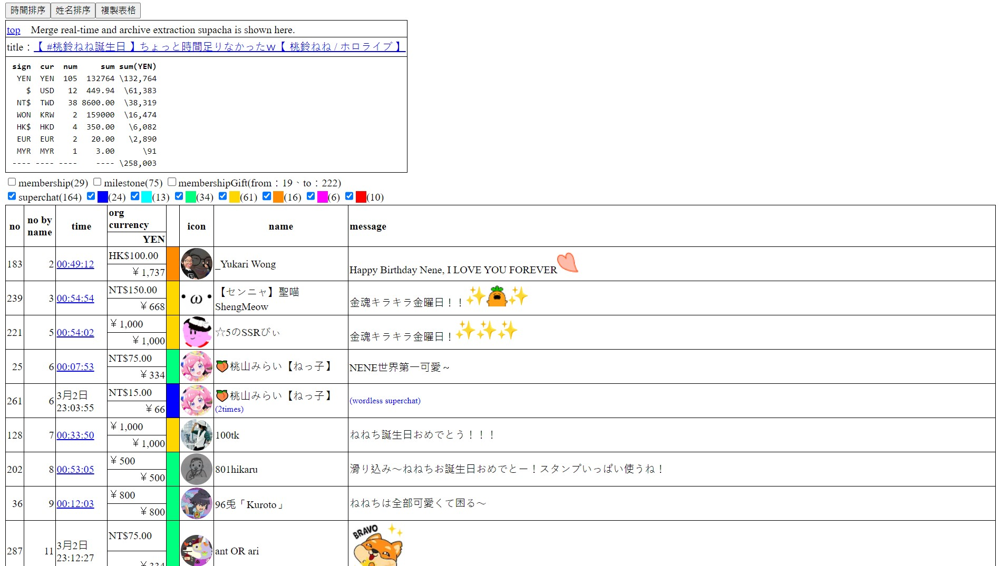
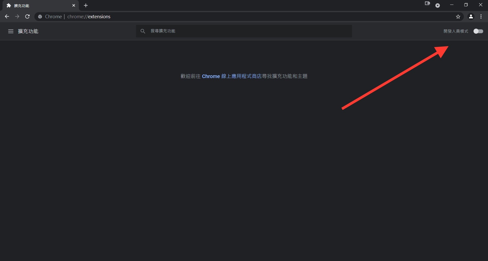
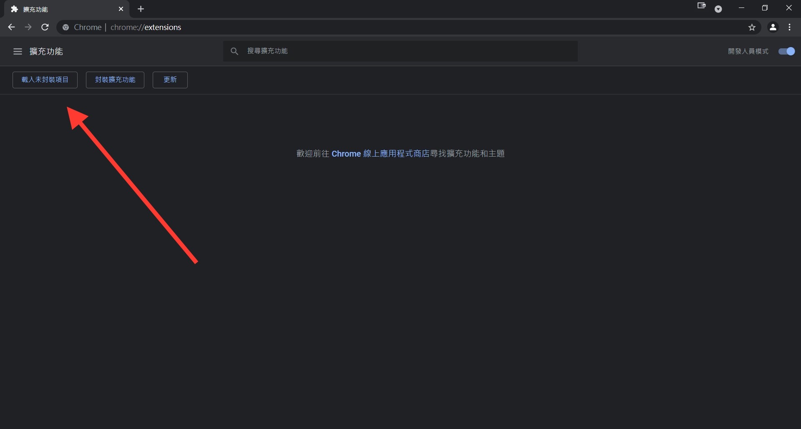
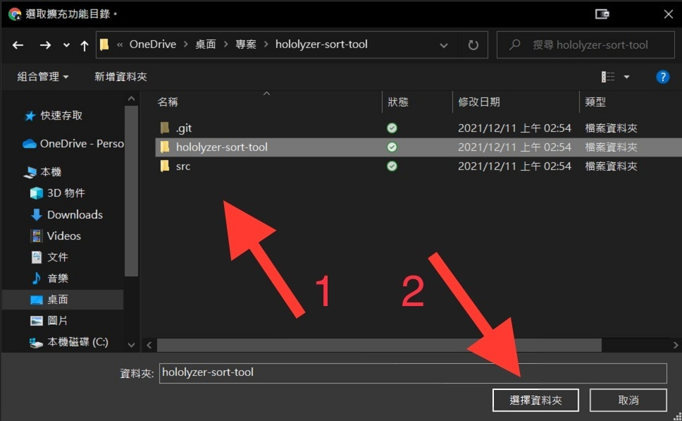
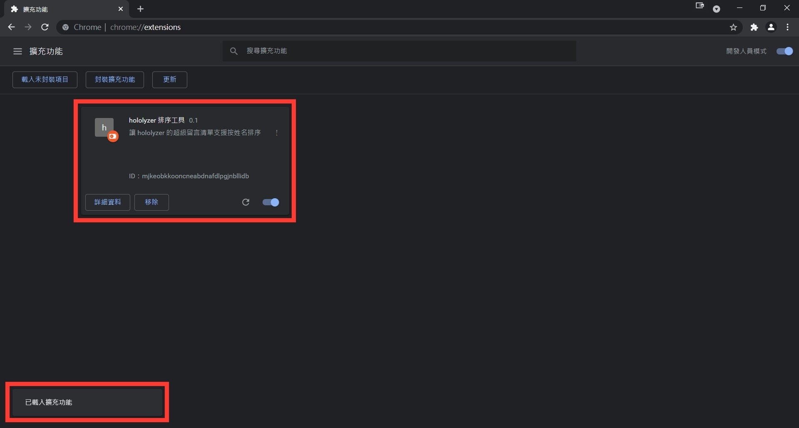

EN | [正體中文](./README_TW.md) | [简体中文](./README_CN.md)

# hololyzer Sort Tool

Add support for sorting hololyzer's super chat list by name.

## Demo

## Usage

* Using Chrome Extension

    1. Download "[hololyzer-sort-tool.zip](./hololyzer-sort-tool.zip?raw=1)" and unzip it

    1. Go to [chrome://extensions/](chrome://extensions/)

    1. Open Developer mode

        

    1. Click「Load unpacked」

        

    1. Choose unzip folder

        

    1. Finish

        

* Using UserScript ([Tutorial form GreasyFork](https://greasyfork.org/en))

    1. Install a user script manager

    1. Download or open "[hololyzer-sort-tool.user.js](https://greasyfork.org/en/scripts/436870)"
