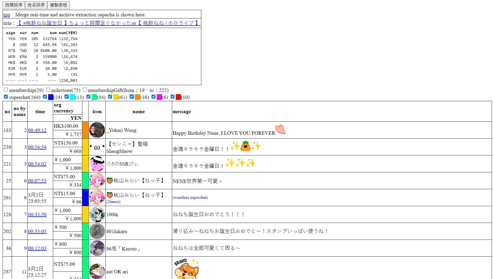
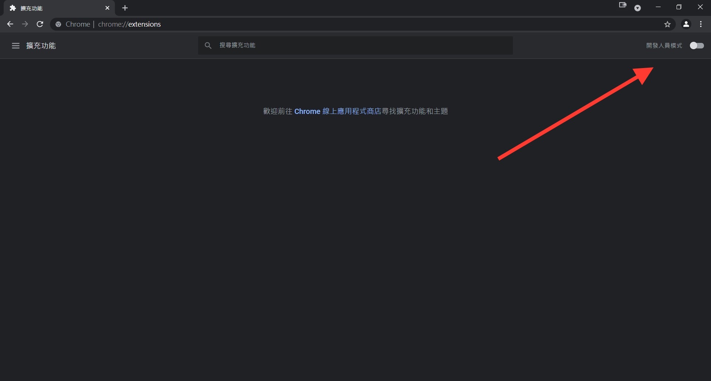
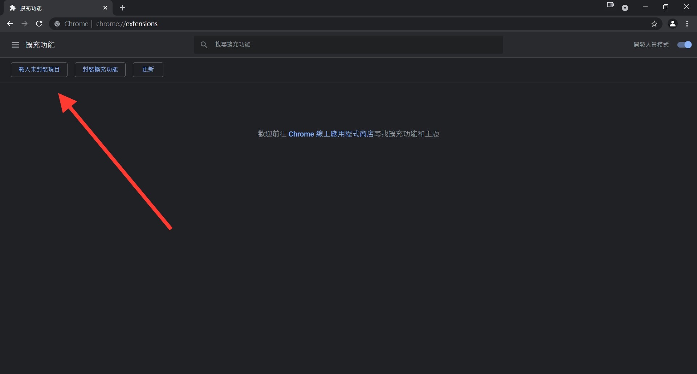
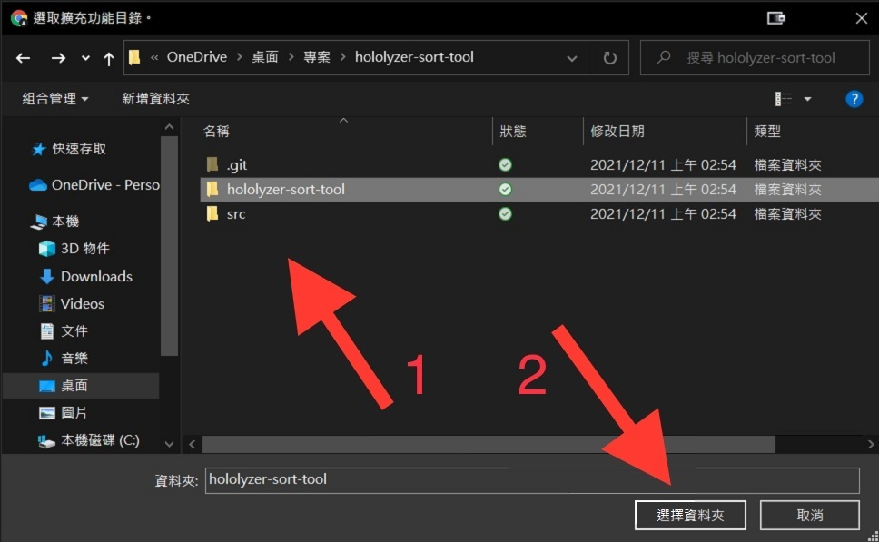

[EN](./README.md) | [正體中文](./README_TW.md) | 简体中文

# hololyzer 排序工具

让 hololyzer 的超级留言清单支持按姓名排序

## 演示

## 如何使用

* 使用 Chrome Extension

    1. 下载「[hololyzer-sort-tool.zip](./hololyzer-sort-tool.zip?raw=1)」并解压缩

    1. 前往 [chrome://extensions/](chrome://extensions/)

    1. 开启开发人员模式

        

    1. 点击「载入未封装项目」

        

    1. 选择解压缩后的资料夹

        

    1. 完成

        

* 使用 UserScript（[GreasyFork 教学](https://greasyfork.org/zh-CN)）

    1. 安装使用者脚本管理器

    1. 下载或开启「[hololyzer-sort-tool.user.js](./hololyzer-sort-tool.user.js?raw=1)」
